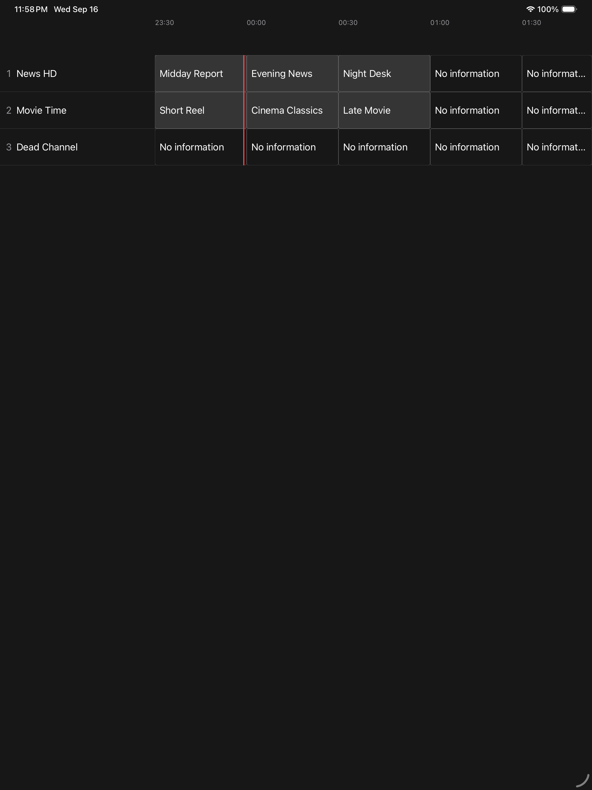
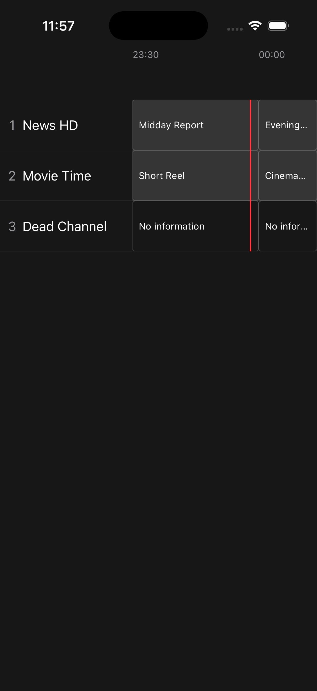
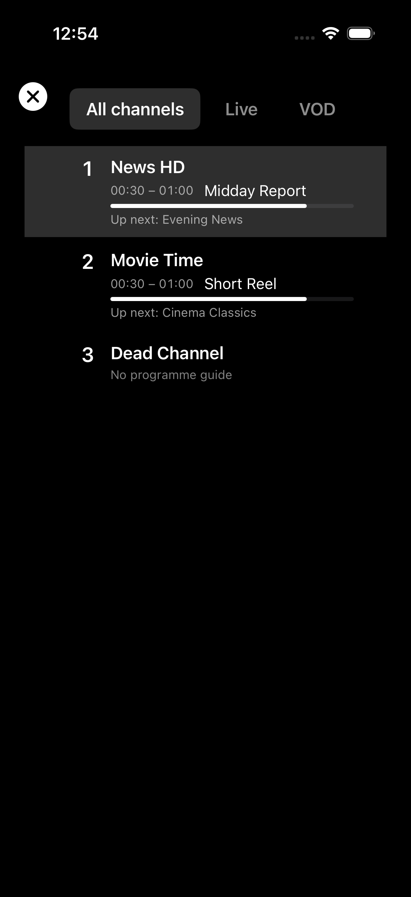
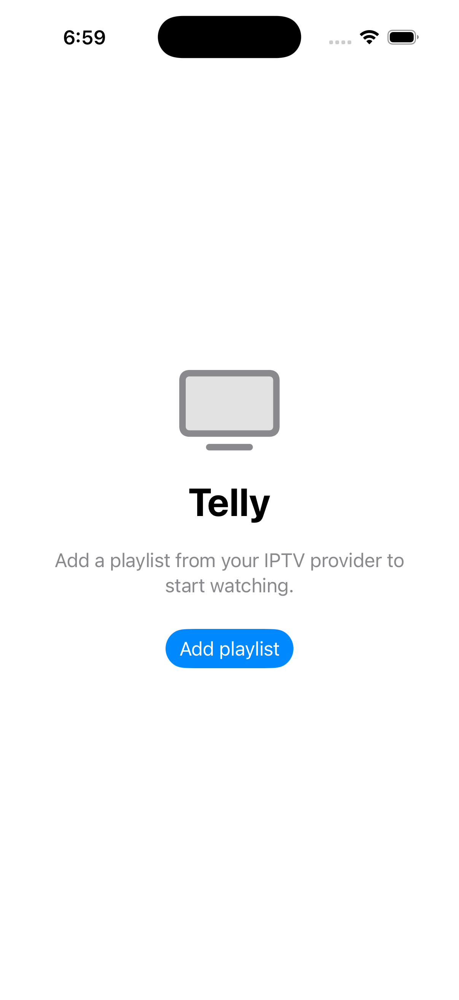
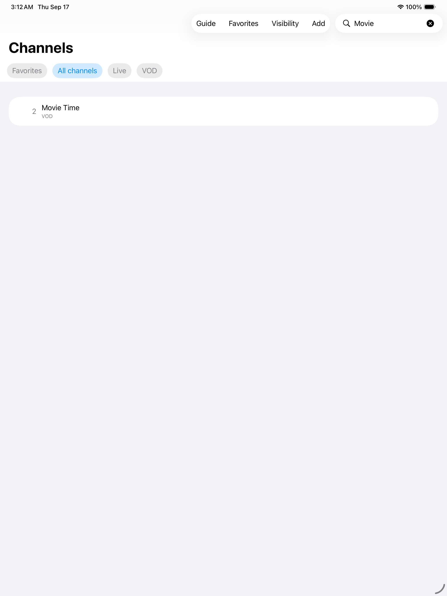
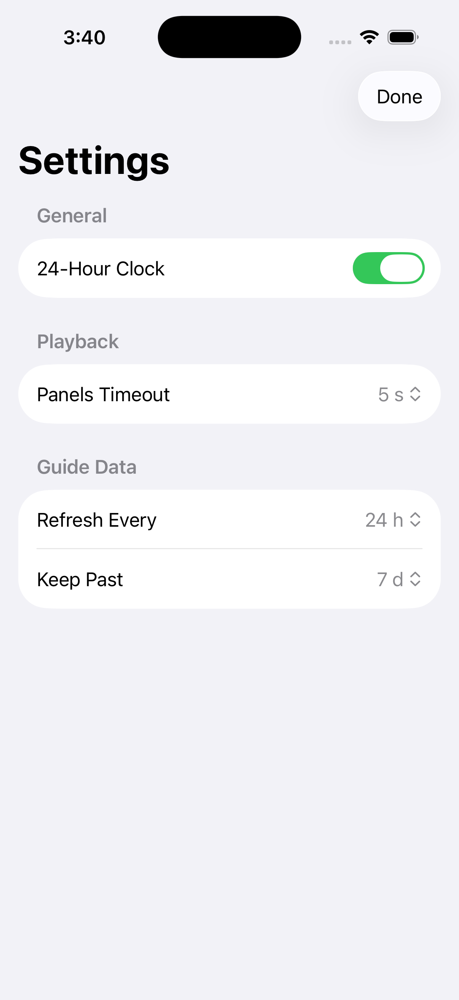
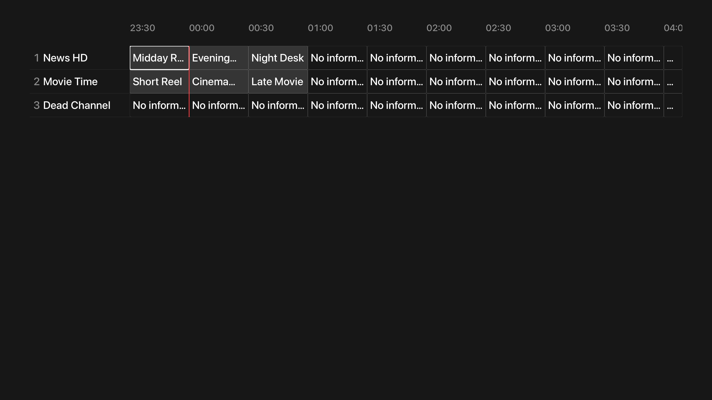
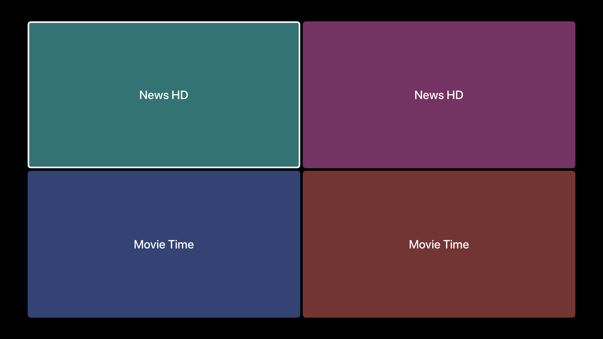
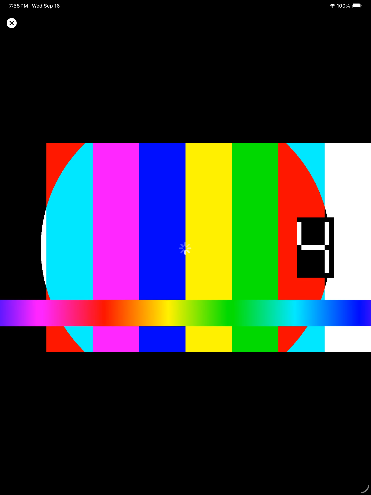

<p align="center">
  
</p>

<h1 align="center">Telly</h1>

<p align="center"><b>An open-source, TiviMate-style IPTV player for iPhone, iPad, and Apple TV.</b></p>

<p align="center">
  <a href="../../actions/workflows/ci.yml"></a>
  
  
  <a href="LICENSE"></a>
  
</p>

<p align="center">
  
</p>

Telly is a native SwiftUI live-TV app for Apple platforms. Bring your own M3U
playlist and XMLTV EPG and you get a fast TV guide, instant channel zapping,
catch-up, VOD, multiview, search, favorites, watch history, and a familiar
channel-surfing feel — on iPhone, iPad, and Apple TV. There is no backend and there
are no accounts: everything is fetched on-device and cached locally. There is also
no premium tier — **every feature TiviMate paywalls ships free here**.

> Telly is an independent open-source project inspired by TiviMate's UX. It is
> **not affiliated with, endorsed by, or connected to TiviMate** or its developers
> in any way. It is a companion port of the Android
> [`telly`](https://github.com/johnpc/telly) app to Apple platforms.

## Screenshots

> All screenshots use Telly's built-in demo/test-fixture playlist (channels
> "News HD / Movie Time / Dead Channel" with color-bar demo streams) — no real
> provider is shown.

| TV guide (iPhone) | Channel list panel | Onboarding |
| --- | --- | --- |
|  |  |  |

| Search | Settings | Catch-up |
| --- | --- | --- |
|  |  |  |

**Apple TV — full-screen EPG grid**

<p align="center">
  
</p>

**Multiview — up to four streams at once**

<p align="center">
  
</p>

**Live playback**

<p align="center">
  
</p>

## Features

Everything below ships free — Telly has no premium tier and no paywalls.

- **TV guide** — a timeline EPG grid with a live now-line, channel numbers,
  now/next, programme details, and day navigation.
- **Instant zapping** — channel up/down (and number entry) with a TiviMate-style zap
  overlay showing the channel number, current programme, and what's next.
- **Playback overlays & quick-bar** — info overlay (times, progress, now/next, stream
  details) plus a quick-bar for the channel list, search, multiview, track pickers
  (video / audio / subtitle-CC), and audio sync.
- **Channel-list panel** — groups + channels over the dimmed video with now-playing
  info, progress bars, and up-next, filterable by All / Live / VOD.
- **Catch-up** — channels that advertise catch-up in the playlist play already-aired
  programmes straight from the guide, with a full seek transport. Community source
  types are supported (default/template, append, shift, flussonic, xtream-codes).
- **VOD** — movie-style playlist entries become a Movies library with seekable
  playback that remembers your position and offers resume.
- **Multiview** — watch up to four streams at once in a mosaic; focus moves between
  panes and audio follows the focused pane.
- **Search** — search channels by name/number and programmes by title, with results
  spanning live and VOD.
- **Favorites & custom groups** — mark favorites and organize channels into your own
  groups.
- **My List & watch history** — save programmes to My List; recently watched channels
  are one tap away and the full history log is browsable and clearable.
- **Parental controls** — a salted-PIN lock with per-channel blocking; blocked
  channels prompt for the PIN before they tune.
- **Settings & backup** — clock format, panel timeouts, EPG refresh interval and
  past-days retention, playback options, and configuration backup/restore.
- **Simple onboarding** — first run just asks for your playlist URL (the EPG URL is
  pre-filled from the playlist's `url-tvg` hint when present).

## Platform support

- **iOS 18** (iPhone), **iPadOS 18** (iPad), **tvOS 18** (Apple TV).
- Native SwiftUI on all three; a single universal app target
  (`TARGETED_DEVICE_FAMILY = 1,2,3`).
- No backend, no account. Your playlist and EPG URLs never leave the device;
  guide/playlist data is fetched directly and cached in a local SQLite database (GRDB).

## Getting started

1. Launch Telly. On first run it asks for a playlist — tap **Add playlist** and enter
   the M3U URL from your IPTV provider.
2. If your playlist carries a `url-tvg` hint, the XMLTV EPG URL is pre-filled;
   otherwise add one under **Settings**.
3. That's it — playback starts and the TV guide is a tap/press away.

## Beta (TestFlight)

Telly ships to Apple platforms via **TestFlight** (iPhone, iPad, and Apple TV).
Ask the maintainer for a TestFlight invite, or build from source below.

## Build from source

Requirements: **macOS with Xcode 26** (iOS 18 / tvOS 18 SDKs),
[`xcodegen`](https://github.com/yonaskolb/XcodeGen) (`brew install xcodegen`), and
Python 3 (for the quality-gate scripts).

```sh
# 1. Generate the Xcode project from project.yml (source of truth)
xcodegen generate

# 2. Open in Xcode and run on a simulator or device
open Telly.xcodeproj

# …or build straight from the command line:
xcodebuild build -scheme Telly \
  -destination 'platform=iOS Simulator,name=iPhone 17 Pro'
xcodebuild build -scheme Telly \
  -destination 'platform=tvOS Simulator,name=Apple TV 4K (3rd generation)'
```

Swift Package dependencies (resolved automatically by Xcode / SPM):
- **SWCompression** — gzip/xz decompression for compressed XMLTV EPG feeds.
- **GRDB** — SQLite persistence (mirrors the Android Room layer 1:1).
- **VLCKitSPM** — libVLC behind a protocol seam (IPTV serves raw MPEG-TS, which
  AVPlayer cannot decode, so playback runs through VLCKit).

## Quality gates & testing

Telly enforces the same bar as the Android original — "fix the code, never the gate."
Run everything locally with one command:

```sh
./scripts/install-hooks.sh   # one-time: enable the pre-commit gate
./scripts/quality.sh         # run every gate (authoritative)
```

`scripts/quality.sh` runs, in order:

1. **Source line limit** — every Swift source file ≤ 100 lines (views render, logic
   lives in ViewModels/Stores/Services).
2. **Acceptance specs in sync** — generated acceptance tests match the `.feature` files.
3. **Static checks** — dead code, duplication, banned types, and Halstead difficulty ≤ 20.
4. **Unit tests + coverage (iOS)** — `xcodebuild test` with code coverage.
5. **Coverage ≥ 80% + CRAP ≤ 30**.
6. **Build (iOS)**.
7. **Build (tvOS)**.

CI (`.github/workflows/ci.yml`) runs the same gates on a macOS runner. The pre-commit
hook (`scripts/pre-commit`, installed via `core.hooksPath`) runs a fast subset
(line-limit → spec sync → unit tests → build) so broken code never lands.

## Contributing

Contributions welcome. Please use **conventional commits**
(`feat:`, `fix:`, `chore:`, `refactor:`, `test:`, `docs:`, `ci:`) and make sure
`./scripts/quality.sh` is green before opening a PR — CI enforces the same gates.
UI-affecting PRs should include a screenshot or screen recording from the simulator.

## License

Released under the [MIT License](LICENSE).
